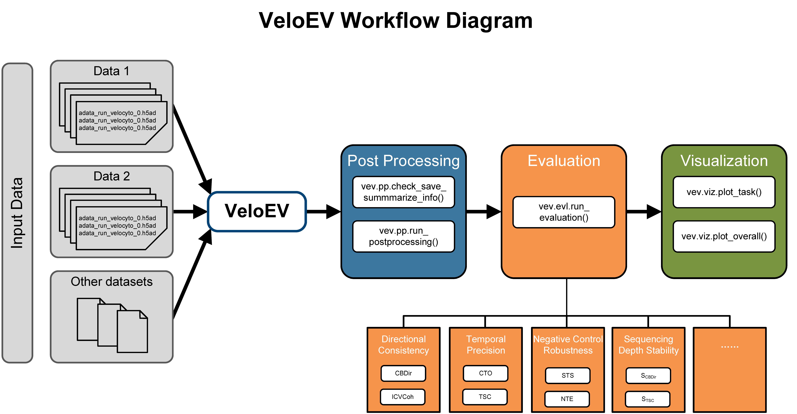

# VeloEV: Evaluation and Visualization for RNA Velocity methods benchmarking

**VeloEV** is a comprehensive Python package designed for post processing, evaluating, and visualizing RNA velocity methods. It streamlines the workflow into three core modules: **Post-processing**, **Evaluation**, and **Visualization**.



## 🚀 Features

* **Post-processing**: Standardizes outputs from diverse RNA velocity methods into a unified format for consistent downstream analysis.
* **Evaluation**: Provides comprehensive metrics to assess velocity accuracy, including **Directional Consistency** (CBDir, ICVCoh), **Temporal Precision** (CTO, TSC), and **Negative Control Robustness** (STS, NTE).
* **Visualization**: Generates figures for both specific task analysis and aggregated global benchmark summaries.

## 📦 Installation

You can install `veloev` by cloning the repository and installing it via pip.

```bash
git clone https://github.com/edawu11/VeloEV.git
cd VeloEV
pip install .
```
## 📖 Documentation & Tutorials

👉 We provide detailed documentation and step-by-step [tutorials](https://veloev.readthedocs.io/) to help you get started.

For quick start, you can download the demo datasets via XXX.

## 📚 Reference
If you use VeloEV in your research, please cite our paper:

Yida Wu, Chuihan Kong, Zhixiang Lin, Xiaobo Sun, Jin Liu. Comprehensive benchmarking of RNA velocity methods across single-cell datasets. Preprint. 2025.

## 📄 License

This project is licensed under the MIT License - see the LICENSE file for details.