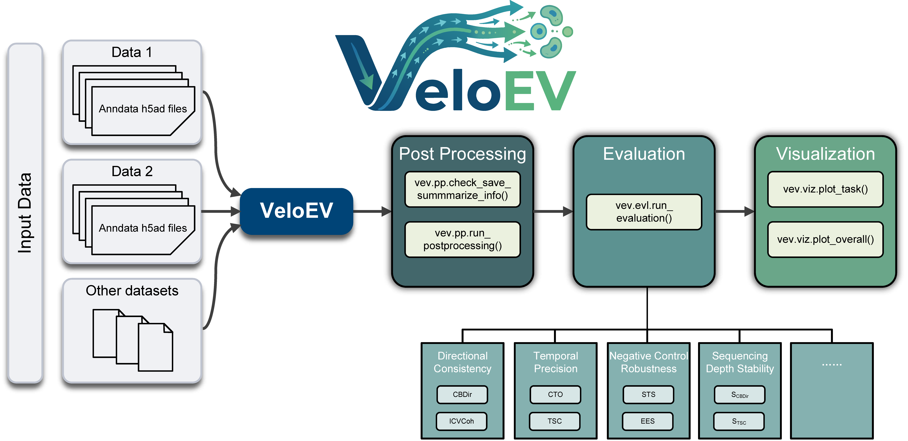

# VeloEV: Evaluation and Visualization for Benchmarking RNA Velocity Methods

**VeloEV** is a comprehensive Python package designed for post processing, evaluating, and visualizing RNA velocity methods. It streamlines the workflow into three core modules: **post-processing**, **evaluation**, and **visualization**.



## 🚀 Features

* **Post-processing**: Standardizes outputs from diverse RNA velocity methods into a unified format for consistent downstream analysis.
* **Evaluation**: Provides comprehensive metrics to assess RNA velocity and cell-specific latent time, including **Directional Consistency** (CBDir, ICVCoh), **Temporal Precision** (CTO, TSC), and **Negative Control Robustness** (STS, EES).
* **Visualization**: Generates figures for both specific task analysis and aggregated global benchmark summaries.

## 📦 Installation

You can install `veloev` by cloning the repository and installing it via pip.

```bash
git clone https://github.com/edawu11/VeloEV.git
cd VeloEV
pip install .
```
## 📚 Documentation & Tutorials

👉 Detailed documentation and step-by-step [tutorials](https://veloev.readthedocs.io/en/latest/) are available to help you get started. For a quick start, you can download the demo datasets via the [link](https://drive.google.com/file/d/1SfYnvxdxOAkAw3AefMBsnWgvDz6IK4ey/view?usp=drive_link).

## 📖 Reference
If you use VeloEV in your research, please cite our paper:

```bibtex
@article{wu-Comprehensive-2026,
  title = {Comprehensive Benchmarking of {{RNA}} Velocity Methods across Single-Cell Datasets},
  author = {Wu, Yida and Kong, Chuihan and Liao, Xu and Lin, Zhixiang and Sun, Xiaobo and Liu, Jin},
  year = 2026,
  journal = {Genome Biology},
  volume = {27},
  number = {1},
  pages = {242}
}
```

## 📄 License

This project is licensed under the MIT License - see the LICENSE file for details.