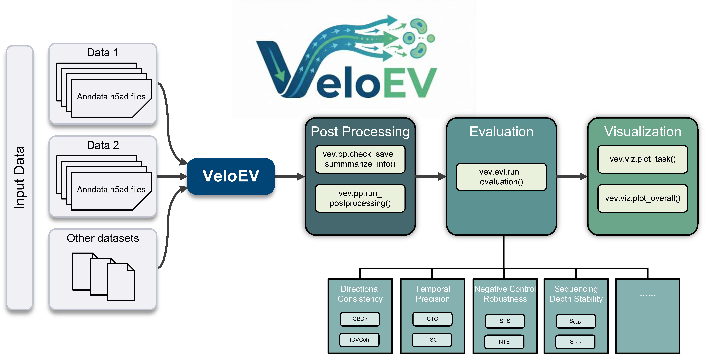

VeloEV Documentation
===============================

Welcome to VeloEV's documentation! VeloEV is a comprehensive Python package designed for benchmarking RNA velocity methods.

===============================
Installation Guide
===============================

You can install `veloev` by cloning the repository and installing it via pip.

.. code-block:: bash

   git clone https://github.com/edawu11/VeloEV.git
   cd VeloEV
   pip install .

===============================
Quick Start
===============================

For RNA velocity method implementation details, please visit our `GitHub <https://github.com/edawu11/Benchmark-RNA-Velocity.git>`_ repository.

To quickly start the evaluation and visualization, you can download demo data covering four methods and three datasets via this `link <https://drive.google.com/drive/folders/1GWvnG897EhheAcX-oKjMq_z5d9Mrd4Ln?usp=sharing>`_.
===============================
Tutorials
===============================

Explore our comprehensive tutorials to get started with VeloEV:

.. toctree::
   :maxdepth: 2
   :caption: Tutorials:

   tutorials/01_postprocessing
   tutorials/02_evaluation
   tutorials/03_visualization
